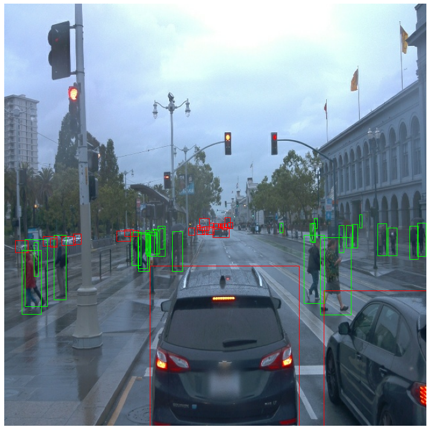
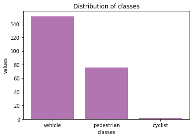

# Object Detection in an Urban Environment

## Project Overview
In this project, a convolutional neural network is created to detect and classify objects using data from Waymo. The dataset contains images of urban environments containing annotated cyclists, pedestrians and vehicles.First, an extensive data analysis including the computation of label distributions, display of sample images, and checking for object occlusions is performed.This analysis will decide what augmentations are meaningful for this project. Then, a neural network is trained to detect and classify objects.<br>

The training is monitored with a TensorBoard. Finally, hyperparameters's are tuned to improve the model's performance.<br>

This project will include use of the TensorFlow Object Detection API, where you can deploy you model to get predictions on images sent to the API. A short video is created to assess the model predictions.<br>


## Set up
There are two options for the project: using the classroom workspace, with the necessary libraries and data already available for you, or local setup. If you want to use a local setup, you can use the below instructions for a Docker container if using your own local GPU, or otherwise creating a similar environment on a cloud provider's GPU instance. <br> 
1. For local setup if you have your own Nvidia GPU, you can use the provided Dockerfile and requirements in the [build directory](https://github.com/udacity/nd013-c1-vision-starter/tree/main/build).
Follow [README there with in](https://github.com/udacity/nd013-c1-vision-starter/tree/main/build/README.md) to create a docker container and install all prerequisites.. <br> 
2. If you are using the classroom environment, the detailed instructions are provided in [README.md](https://github.com/viveksurendranath90/Object-detection-in-an-urban-env/blob/main/README.md). <br>

Alternatively, `clone` my repository for the project files:
```
git clone https://github.com/viveksurendranath90/Object-detection-in-an-urban-env
```
## Dataset
The dataset from [Waymo Open dataset](https://waymo.com/open/) is used for this project. The 100 datasets are splitted and provided as `.tfrecord` files in the `workspace/data` directory. The data is provided as follows:<br>
* **train**: 86% or 86 `.tfrecord` files for training the models
* **val**: 10% or 10 `.tfrecord` files for validating the model training process
* **test**: 3% or 3 `.tfrecord` files to test the model and to create inference videos

## Exploratory Dataset Analysis
This section contains a quantitative and qualitative description of the dataset.The data already present in `/home/workspace/data` directory is used to explore the dataset!. This can be done by launching `Exploratory Data Analysis` notebook. The three object classes are marked in rectabgular coloured boxes green (cyclists), red (cars), blue(pedestrians). 
| | |
|:---------------:|:---------------:|
| |  |
<hr>

As an additional exploration, we are examining the distribution of classes in the image dataset.Here I take 10 random images to evaluate the class variance.


### Cross validation

As you can see above, the class variance even in minimum number of images is very high. To get an insight on how well the model perform for an independent dataset a seperate validation set is required. Cross validation is necessary here to avoid overfitting or selection bias. Also, we need seperate validation and test set as we are trying different combination of hyperparameters to tune the model. Here data is split into 86% for training, 10% for validation and 3% for test.

### Training

The Tf Object Detection API relies on **config files**. The config that we will use for this project is `pipeline.config`, which is the config for a SSD Resnet 50 640x640 model. You can learn more about the Single Shot Detector [here](https://arxiv.org/pdf/1512.02325.pdf).

#### Reference experiment
For reference experiment training process can be launched by:
```
python experiments/model_main_tf2.py --model_dir=experiments/reference/ --pipeline_config_path=experiments/reference/pipeline_new.config
```
Once the training is finished, launch the evaluation process:

```
python experiments/model_main_tf2.py --model_dir=experiments/reference/ --pipeline_config_path=experiments/reference/pipeline_new.config --checkpoint_dir=experiments/reference/
```

To monitor the training, you can launch a tensorboard instance by running `python -m tensorboard.main --logdir experiments/reference/`.
Below images contain the performance matrix of model.
* Performance metrics - training loss *(red)* vs. validation loss *(blue)*<br>


* Performance metrics - Detection box prediction<br>


* Performance metrics - learning rate<br>


The classification loss between training (.5132) and evaluation (.5560) is .428. Ideally, we have to improve the model for a better prediction on unseen data. Also, it should be noted that detection boxes precision for large and medium boxes can be improved.

#### Improve on the reference

Most likely, this initial experiment did not yield optimal results. However, you can make multiple changes to the config file to improve this model. One obvious change consists in improving the data augmentation strategy. The [`preprocessor.proto`](https://github.com/tensorflow/models/blob/master/research/object_detection/protos/preprocessor.proto) file contains the different data augmentation method available in the Tf Object Detection API. The augmentations can be visualized using following notebook: `Explore augmentations.ipynb`.
I used the following augmentations:
* random_horizontal_flip
* random_crop_image
* random_distort_color
* random_jpeg_quality
* random_adjust_brightness
* random_adjust_contrast
* random_rgb_to_gray
* random_pixel_value_scale
* random_distort_color

| | |
|:---------------:|:---------------:|
| |  |
| |  |
| |

The new model with added augmentaion serves the basline for the experiment 1, which can  be launched by:
```
python experiments/model_main_tf2.py --model_dir=experiments/experiment1/ --pipeline_config_path=experiments/experiment1/pipeline_new.config
```
The improved model performance matrix is as follows:
* Performance metrics - training loss *(red)* vs. validation loss *(blue)*<br>


* Performance metrics - Detection box prediction<br>


It can be noted that the classification loss between training (.3804) and evaluation (.3951) is .147 is improved. Also, the detection boxes precision for large and medium boxes is improved.

### Result

The interference video for multiple set of test dataset is created.
The object detection results are shown in the video below:


<hr>


<hr>
